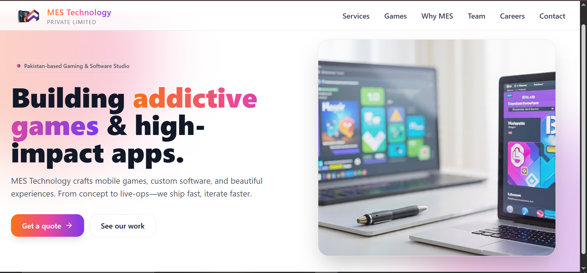
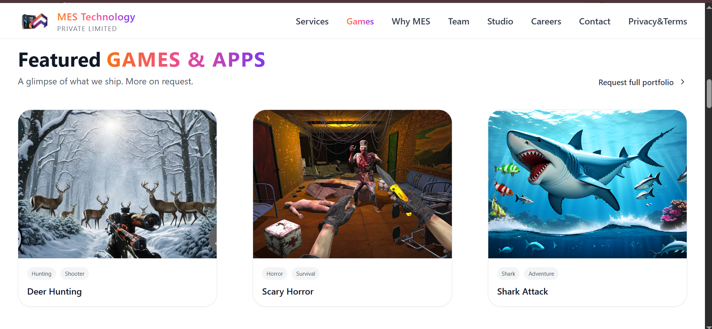
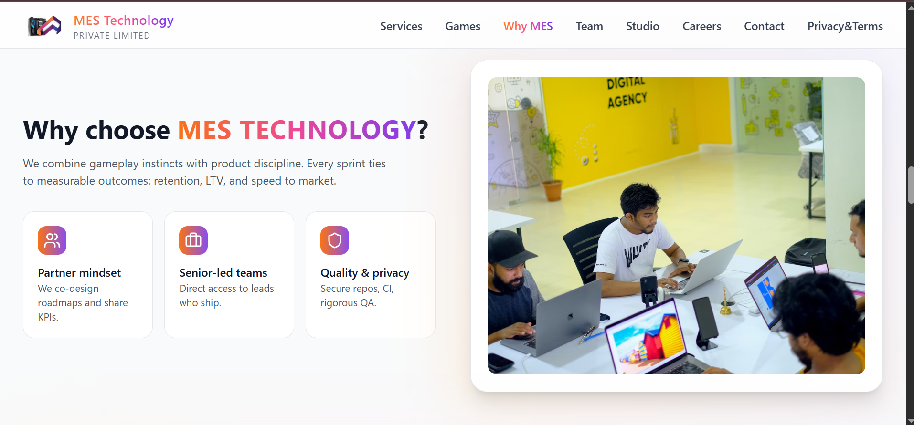
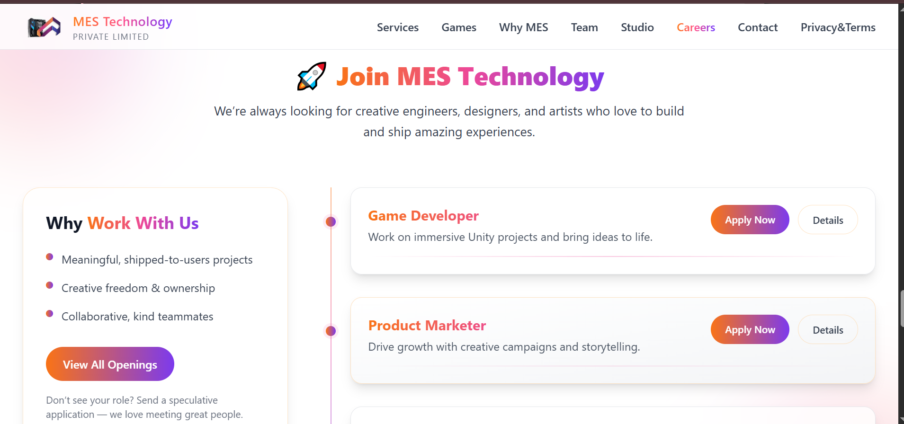

# MES Technology - Software & Gaming Studio Website

[](https://software-agency-website-react.vercel.app/)


A modern, responsive corporate website for a fictional software and gaming studio, **MES Technology**. Built with React, Vite, and Tailwind CSS, this practice project features a sleek UI with dynamic portfolio showcases, company value propositions, and a career openings section. Designed to demonstrate modern frontend development.

## 📸 Project Previews

Here is a look at the different sections of the website:

### Hero & Navigation


### Featured Games & Apps Portfolio


### Why Choose MES & Studio Culture


### Careers & Open Positions


## 🚀 Features

* **Hero Section:** An engaging introductory section with a clear call-to-action and a modern gradient aesthetic.
* **Dynamic Portfolio:** A visually appealing grid layout showcasing featured game and app projects.
* **Value Proposition:** A clean, icon-driven section highlighting company workflows, culture, and quality assurance.
* **Careers & Hiring Portal:** A structured layout displaying open positions (e.g., Game Developer, Product Marketer) with integrated application buttons.
* **Fully Responsive:** Optimized for both desktop and mobile viewing.

## 🛠️ Tech Stack

* **Framework:** [React 18](https://react.dev/)
* **Build Tool:** [Vite](https://vitejs.dev/)
* **Styling:** [Tailwind CSS](https://tailwindcss.com/)
* **Hosting:** [Vercel](https://vercel.com/)

## 💻 Getting Started (Local Development)

To get a local copy up and running:

1. Clone the repository:
   ```bash
   git clone [https://github.com/malaikaahsan/software-agency-website-react.git](https://github.com/malaikaahsan/software-agency-website-react.git)
   ```
2. Navigate into the project directory:
   ```bash
   cd software-agency-website-react
   ```
3. Install the dependencies:
   ```bash
   npm install
   ```
4. Start the development server:
   ```bash
   npm run dev
   ```
5. Open your browser and visit `http://localhost:5173`.


## 👨‍💻 Author

**Malaika Ahsan**
* GitHub: [@malaikaahsan](https://github.com/malaikaahsan)

---
*This is a practice project created for learning and portfolio demonstration purposes.*
